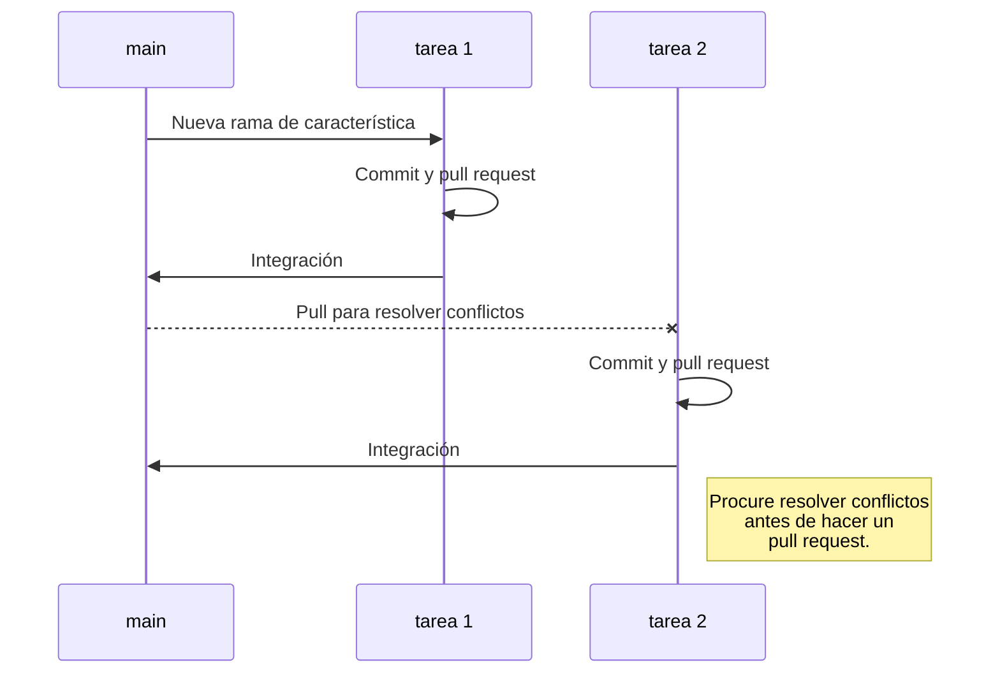

# GSP-Backend

#### Proyecto 1 2022.2
Repositorio para aplicación backend del proyecto de Traza de PQRSF para la Secretaría General de la Universidad del Cauca.
Este proyecto está desarrollado usando príncipalmente Django, con la ayuda de otras librerías como Django REST framework.
A continuación se va a dar una guía breve para empezar a trabajar en el desarrollo de la aplicación de forma colaborativa y ágil.


# Configuración

En primer lugar **clone el repositorio**, para trabajar en un ambiente aislado cree un **ambiente virtual**.

### Ambiente Virtual
En la **carpeta inicial** del repositorio
```
python3 -m venv env
```
Para entrar a la consola del ambiente virtual en **Linux**
```
source env/bin/activate
```
O en **Windows**
```
env\Scripts\activate
```
### Instale Django y Django REST framework
Además de Django, se va a utilizar un framework para facilitar la creación de API REST en Django, **ambos frameworks** deben ser instalados en el **ambiente virtual** o de forma global en caso de no utilizar en entorno virtual.

Desde la consola del **ambiente virtual**
```
pip install django
```
Luego
```
pip install djangorestframework
```
Finalmente, la siguiente librería para habilitar peticiones desde dominios externos
```
pip install django-cors-headers
```### Migraciones para la Base de Datos
Utilice el siguiente comando para crear las migraciones a partir de los **modelos** del proyecto. Este comando también se debe ejecutar cuando se realicen cambios en los modelos.
Desde la consola en la raíz del proyecto
```
python manage.py makemigrations
```
Luego, para hacer efectivas las migraciones a la base de datos
```
python manage.py migrate
```
### Creación de un Super-Usuario
Django provee una implementación completa de **autenticación**, incluido el rol de super-usuario. Es necesario crear un super-usuario, para acceder a la base de datos y realizar cambios desde el CRUD que provee Django por defecto.
Desde la consola en la raíz del proyecto, use el siguiente comando e ingrese los datos según se soliciten
```
python manage.py createsuperuser
```
De forma alternativa, puede utilizar el siguiente comando con los datos del usuario en una sola línea
```
python manage.py createsuperuser --username "nombre de usuario" --password "contraseña" --email usuario@dominio.com
```
### Correr el servidor de Django
Django provee un servidor que facilita el desarrollo de aplicaciones. El servidor permite visualizar cambios a la aplicación en tiempo real y provee un CRUD para los modelos del proyecto.
Utilice el siguiente comando desde la consola en la raíz del proyecto
```
python manage.py runserver
```
Finalmente, desde el navegador diríjase a la dirección indicada por Django para acceder al servidor que aloja la aplicación.
>Por defecto, el servidor se alberga en la siguiente dirección: http://localhost:8000/
>De la misma forma el administrador o CRUD por defecto de Django se puede acceder desde: http://localhost:8000/admin/
# Manejo de Versiones
Para el manejo de versiones se decidió utilizar la estrategia de ramas de **GitHub Flow**, porque tanto el tamaño del equipo de desarrollo como el alcance del proyecto son pequeños.
En conjunto con la metodología **Kanban**, se van a utilizar una rama por cada tarea, con el fin de mantener un bajo nivel de conflictos de integración.
> Para más información sobre **Github Flow** revise el siguiente enlace: https://docs.github.com/en/get-started/quickstart/github-flow
### Creación de Ramas
La creación de cada rama lleva el siguiente formato
```
git checkout -b "nombre_de_tarea"
```
El **nombre de la rama** debe coincidir con la **tarea** a cumplir en el tablero **Kanban** en **Trello**
>El tablero **Kanban** puede se puede acceder desde el siguiente enlace: https://trello.com/b/j0acPIiE/gsp

Para trabajar desde la nueva rama puede bajar los cambios de la rama principal así
```
git pull --rebase origin main
```
Suba los cambios a la rama nueva no a la rama principal
```
git push origin "nombre_de_tarea"
```
Antes de integrar la rama de característica de la tarea a la rama principal main, la funcionalidad debe ser aprobada por el equipo de pruebas.
Para que los cambios sean aprobados, cree un **Pull Request** desde github una vez de la tarea por terminada.
El flujo de trabajo se puede ver ejemplificado en el siguiente diagrama

# Diagrama de Clases

